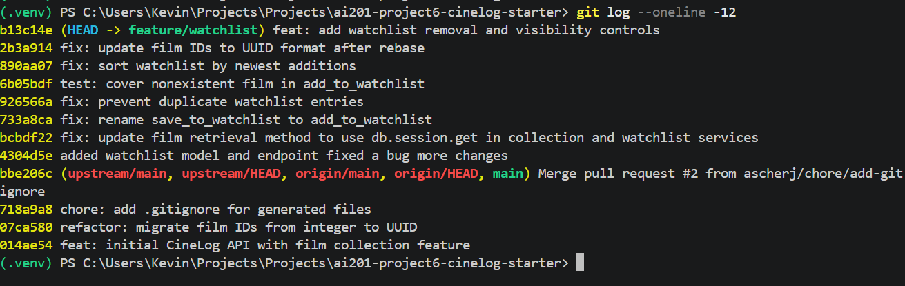

# PR Response — CineLog Watchlist Feature

---

## AI Usage

I used ChatGPT and Claude as learning and debugging assistants throughout this project. I used them to better understand reviewer comments, plan code changes, explain Git concepts such as rebasing, understand Flask routes and service layers, and verify that my implementations followed existing project patterns.

For the harder parts of the implementation — especially the rebase conflict and the deduplication logic — I used Claude to walk through the code step by step and understand what each part was doing before making changes.

I wrote, tested, and verified all code changes locally by running the project's `pytest` test suite before committing each major feature. The AI tools helped me understand the code and reviewer comments, but I reviewed and validated every change before committing. The AI tools helped me understand, but every decision and every line of code was reviewed and confirmed by me.

---

## Comment 1 — Rename

**What I did:**
I renamed `save_to_watchlist()` to `add_to_watchlist()` so the watchlist service follows the same verb-to-noun naming convention used by existing functions such as `add_to_collection()`.

**How I verified:**
I ran a project-wide search for `save_to_watchlist` and found three references: the function definition in `services/watchlist_service.py`, the import in `routes/watchlist/watchlist.py`, and the route call in the same file. I updated all three references, then searched for `save_to_watchlist` again to confirm no old references remained. I also searched for `add_to_watchlist` to confirm the definition, import, and call all used the new name consistently.

---

## Comment 2 — Deduplication

**What I did:**
I added a duplicate check to `add_to_watchlist()` following the same pattern already used by `add_to_collection()` in `services/collection_service.py`. The service now checks for an existing `WatchlistEntry` with the same `user_id` and `film_id`. If one is found, it raises `AlreadyInWatchlistError` instead of creating a duplicate row. The route catches this error and returns HTTP 409 Conflict.

**How I verified:**
I compared the implementation directly with `add_to_collection()` to confirm the same user-and-film lookup pattern was followed. I then ran `pytest tests/ -v` and confirmed all 8 tests passed.

---

## Comment 3 — Missing Test

**What I did:**
I created `tests/test_watchlist.py` and added `test_add_to_watchlist_nonexistent_film_raises()`. The test creates a valid user, passes a `film_id` that does not exist in the database, and confirms that `add_to_watchlist()` raises `FilmNotFoundError`.

**How I verified:**
I modeled the test after `test_add_to_collection_nonexistent_film_raises()` in `tests/test_collection.py`, following the same in-memory database fixture, user fixture, fake film ID, and `pytest.raises()` structure. I ran `pytest tests/test_watchlist.py -v` to verify the new test, then ran the full suite with `pytest tests/ -v` to confirm nothing else broke.

---

## Comment 4 — Default Visibility

**My position:**
I would keep new watchlist entries public by default.

**Reasoning:**
CineLog is a community film-tracking platform, so the watchlist is not only a personal reminder list — it is also a social tool. Public watchlists allow users to discover what friends want to watch, compare film interests, and start conversations around upcoming releases. A public default reduces friction for users who want to participate in those social features and supports the platform's core community value.

**Tradeoff acknowledged:**
A private default would better protect users who do not want their film interests visible automatically, and it would reduce accidental oversharing. However, in CineLog's specific context, a public default better supports discovery and social interaction. Users can still choose private visibility when adding a film, which preserves individual control without reducing the social experience for most users.

---

## Comment 5 — Sort Order

**My position:**
I agree with changing the watchlist sort order from alphabetical to date added, newest first.

**Reasoning:**
A watchlist is primarily used as a planning tool. CineLog users are likely to return to their watchlist to quickly find the films they recently decided to watch. Showing the newest additions first makes those recent decisions immediately visible and reduces the need to scroll through the entire list.

**Engagement with the reviewer's point:**
The reviewer noted that most users want to see what they added recently, and I agree with that behavior in CineLog's context. Alphabetical order is useful when a user already knows the title they are looking for, but recent-first better supports the more common action of reviewing newly saved films. If alphabetical lookup becomes important later, CineLog could add a sort control rather than locking alphabetical order as the only default.

---

## Comment 6 — Rebase

**What conflicted:**
The watchlist feature branch was originally created before the main branch refactored film IDs from integers to UUID strings. After rebasing onto the updated `main` branch, the `WatchlistEntry` model was no longer present in `models.py`, which caused an `ImportError` because `watchlist_service.py` could no longer import it.

**How I resolved it:**
I rebased my `feature/watchlist` branch onto the latest `upstream/main`. I restored the `WatchlistEntry` model to `models.py`, added the `watchlist_entries` relationships back to the `User` and `Film` models, and updated `film_id` to use `db.String(36)` with the `film.id` foreign key so it matched the new UUID-based schema. I also updated the watchlist service documentation and test data to use UUID strings instead of integer IDs.

**How I verified:**
I searched `models.py` to confirm that `Film.id` and all related `film_id` foreign keys use `db.String(36)`. After restoring the watchlist model and updating it for UUIDs, I ran the full test suite with `pytest tests/ -v` and confirmed all tests passed. I also verified that the branch history remained linear after the rebase, with no merge commits.

---

## PR Description

### Summary

This pull request completes the CineLog watchlist feature by adding watchlist management, duplicate prevention, removal, visibility controls, updated sorting behavior, and automated tests. It also addresses all reviewer comments from the initial review.

### What the Watchlist Feature Does

The watchlist allows users to save films they want to watch later. Users can:

- Add a film to their watchlist
- Retrieve their full watchlist
- Remove a film from their watchlist
- Control whether individual entries are public or private

### Design Decisions

**Default Visibility**
New watchlist entries are public by default because CineLog is designed as a social film platform where users can discover films through friends and recommendations. While private-by-default would provide stronger automatic privacy, public-by-default better supports community interaction while still allowing users to change visibility at any time.

**Sort Order**
The watchlist displays the most recently added films first instead of alphabetical order. This better matches how users typically use a watchlist — returning to check the newest films they saved rather than searching for a specific title.

### Testing

I verified the implementation by running:

```
pytest tests/test_watchlist.py -v
pytest tests/ -v
```

The tests verify:

- Adding a nonexistent film raises `FilmNotFoundError`
- Adding a duplicate entry raises `AlreadyInWatchlistError`
- Removing an existing watchlist entry succeeds
- Removing a missing entry raises `NotInWatchlistError`
- Updating watchlist visibility correctly changes the `public` field
- All existing collection tests continue to pass after changes

---

## Git Log Screenshot


---

## Stretch Feature 1 — `remove_from_watchlist()`

**Implementation:**
I added `remove_from_watchlist(user_id, film_id)` to the watchlist service and a matching DELETE endpoint. The function follows the same pattern as `remove_from_collection()`: it searches for the exact user-and-film entry, deletes it, commits the transaction, and returns `True`.

**Behavior when the film is not present:**
If the film is not currently on the user's watchlist, the function raises `NotInWatchlistError`. The route catches that error and returns HTTP 404 with a clear error message.

**Test added:**
I added a test confirming that an existing watchlist entry is successfully removed from the database.

---

## Stretch Feature 2 — Second Test

**Edge case tested:**
I added a test for attempting to remove a film that is not currently on the user's watchlist.

**Why I selected it:**
Removal operations should fail clearly instead of silently succeeding or causing a database error. This test verifies that `NotInWatchlistError` is raised when no matching user-and-film entry exists, which confirms the error handling path works correctly.

---

## Stretch Feature 3 — Visibility Toggle

**Implementation:**
I added `update_watchlist_visibility(user_id, film_id, public)` and a PATCH endpoint that updates whether an existing watchlist entry is public or private.

**Default behavior:**
New entries remain public by default because the `WatchlistEntry.public` field is defined with `default=True`.

**How a caller uses it:**
The caller sends a PATCH request containing the film UUID and a Boolean `public` value:

```json
{
  "film_id": "UUID-HERE",
  "public": false
}
```

The endpoint finds the matching watchlist entry for the authenticated user and updates the `public` field. If no entry is found, it returns HTTP 404.